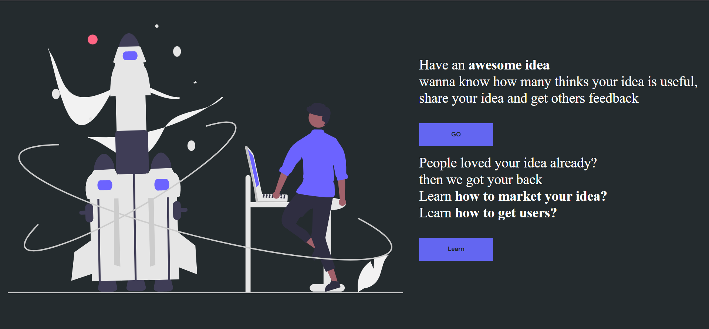
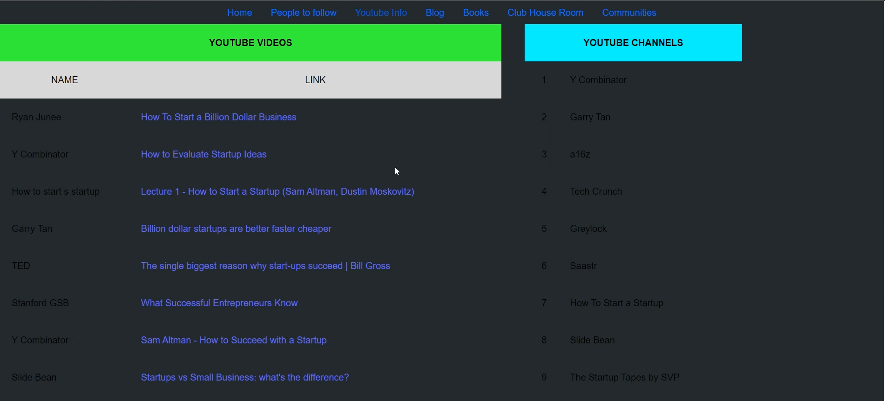

#Ideaon

## A Web platform to share your ideas and get others feedback on it ,learn how to market and get your first users on your idea.

## Technologies used MERN stack

## Steps for installation
- This project is divided into two parts
- To run the backend *Ideaon-Backend* first install all the packages using **npm install**
- Run the project using **npm start**
- your backend is running now 
## FrontEnd
- *Ideaon-Frontend* is different and the other front-end is different i.e. all the files not in a folder
- first run the other files for that install all the packages using **npm install**
- run the project using **npm start**
- your first front-end is running now

## for the ideaon-Frontend follow the same steps

<a href="https://www.youtube.com/watch?v=Nt6GRsLJsjE">Video Demo</a>

